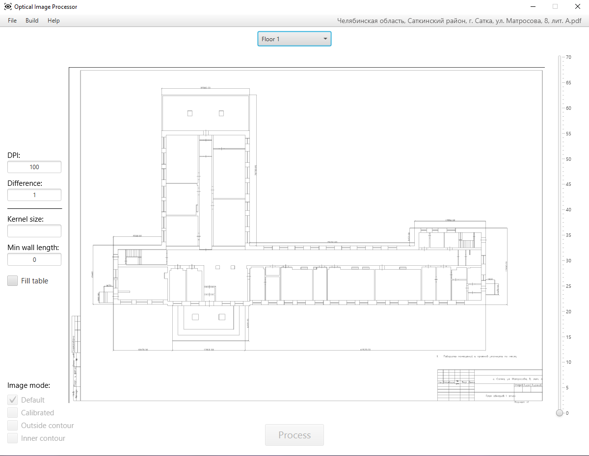
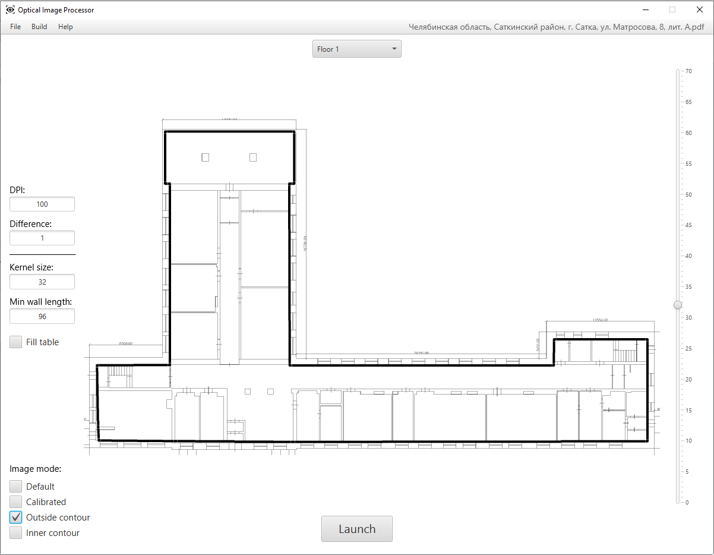

# **Optical Image Processor**

### Программа для автоматизации процесса радиопланирования

____

Блок Java кода отвечает за реализацию графического интерфейса и фактическую функциональность приложения.

- Классы из пакета `PDFProcessor` осуществляют предварительные преобразование шаблонов PDF файлов и их сборку в готовый проект.

- Класс `ImageProcessor` позволяет вызывать реализованный на C++ `.dll` модуль, осуществляющий выделение основных компонентов из схемы здания и их запись в тектовый файл.

- Класс `MyRobot` наносит данные из полученных файлов на новую схему.

Для автоматизированной отрисовки контуров необходимо нажать кнопку `Launch` 

____

<h4 align="center">
  
</h4>

____

<h4 align="center">
  
</h4>

____

<h4 align="center">
  
</h4>

____

